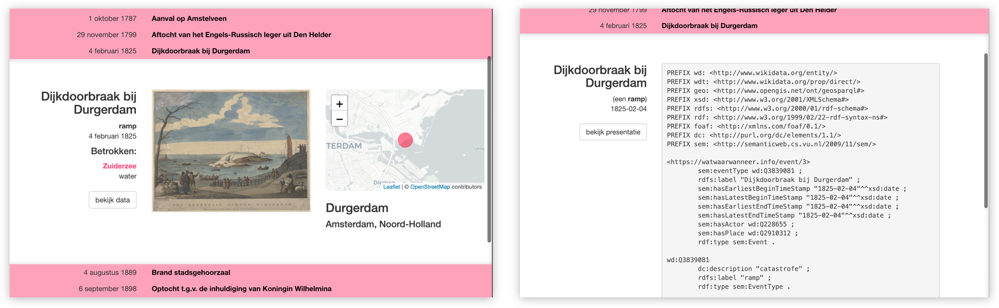

# watwaarwanneer.info

This project might turn into something that identifies events in Dutch history, thus providing heritage institutions with URIs to use within their collections (we definitely need something like that, although preferably an institute with proper resources would initiate such a thing).

At this moment, [watwaarwanneer.info](http://watwaarwanneer.info/), only seeks to answer some practical questions concerning events:

- What kind of events do we find in heritage collections?
- How should we model these events? Will [SEM](https://semanticweb.cs.vu.nl/2009/11/sem/) do?
- In what ways can we present (websites, apps) and publish (as linked data, in APIs) these eventdata?
- What minimum info (URIs) do we need to retrieve information on actors, places and events to create meaningfull presentations?
- What URIs are best used to describe actors, places and events? To what extend is Wikidata (in itself not event-based) [the answer to all questions](https://simple.wikipedia.org/wiki/42_(answer))?
- How do we best build a hierarchy of events? How to retrieve all sub-events of the Dutch Revolt?
- How do we recognize major and minor events?